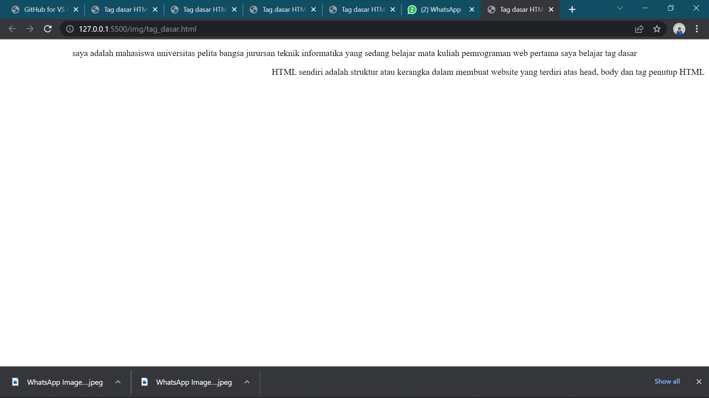
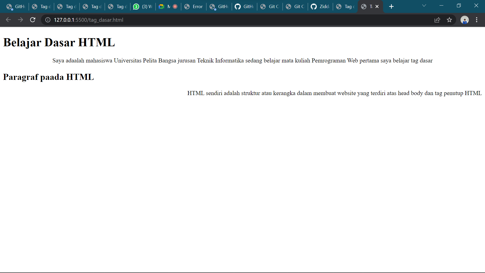

# Lab1Web

| Ziddan Makarim | 312010063 |
| -------------- | --------- |
| TI.20 A.1      | Pemrograman Web |

## Paragraf


Ini adalah hasil dari tag <p>

### contoh codingan
```html
<!DOCTYPE html>
<html lang="en">
<head>
    <meta charset="UTF-8">
    <meta http-equiv="X-UA-Compatible" content="IE=edge">
    <meta name="viewport" content="width=device-width, initial-scale=1.0">
    <title>Tag dasar HTML</title>
</head>
<body>
    <!-- paragraf pertama -->
    <p align="center" >Saya adaalah mahasiswa Universitas Pelita Bangsa jurusan Teknik Informatika sedang belajar mata kuliah Pemrograman Web pertama saya belajar tag dasar</p>
    <!-- paragraf kedua -->
    <p align="right" >HTML sendiri adalah struktur atau kerangka dalam membuat website yang terdiri atas head body dan tag penutup HTML</p>
</body>
</html>
```
## Heading


Ini adalah contoh heading, heading sendiri adalah sebagai judul dari sebuah artikel web. (h1) adalah heading terbesar (h6) adalah heading terkecil.

## contoh coding
```html
<!DOCTYPE html>
<html lang="en">
<head>
    <meta charset="UTF-8">
    <meta http-equiv="X-UA-Compatible" content="IE=edge">
    <meta name="viewport" content="width=device-width, initial-scale=1.0">
    <title>Tag dasar HTML</title>
</head>
<body>
    <!-- judul paragraf pertama -->
    <h1>Belajar Dasar HTML</h1>
    <!-- paragraf pertama -->
    <p align="center" >Saya adaalah mahasiswa Universitas Pelita Bangsa jurusan Teknik Informatika sedang belajar mata kuliah Pemrograman Web pertama saya belajar tag dasar</p>

    <!-- judul paragraf kedua -->
    <h2>Paragraf paada HTML</h2>
    <p align="right" >HTML sendiri adalah struktur atau kerangka dalam membuat website yang terdiri atas head body dan tag penutup HTML</p>
</body>
</html>
```


